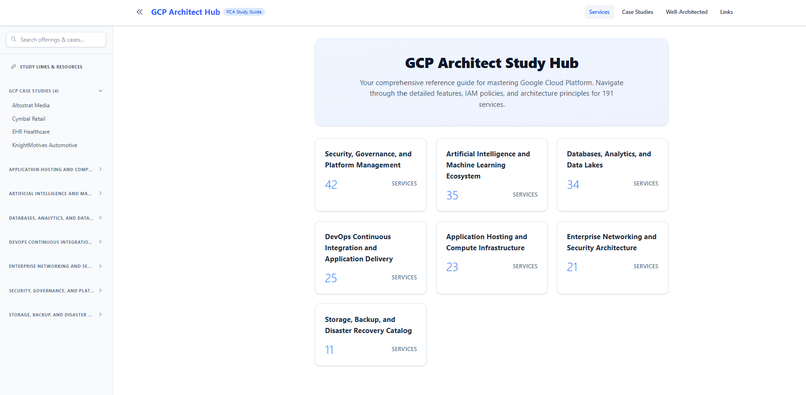
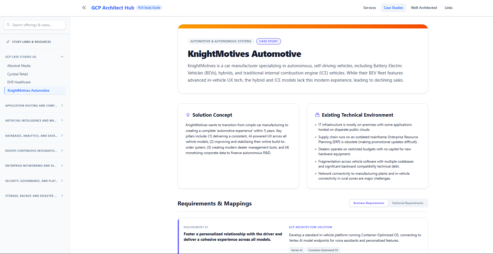
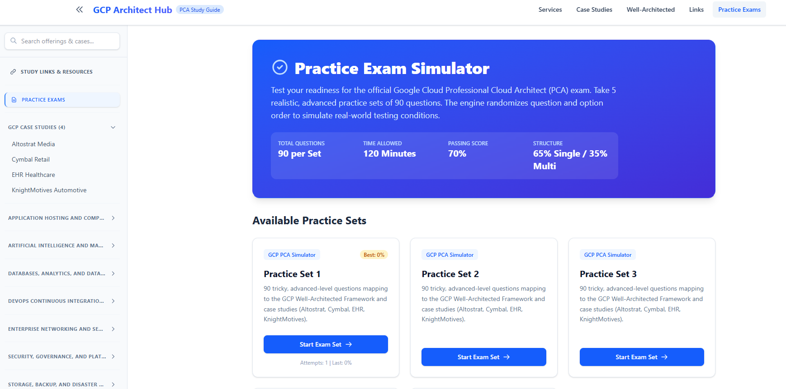

# 🌐 GCP Architect Hub

[](https://svelte.dev)
[](https://kit.svelte.dev)
[](https://tailwindcss.com)
[](https://www.typescriptlang.org)
[](https://vite.dev)

A premium, interactive documentation and study portal tailored for the **Google Cloud Professional Cloud Architect (PCA) Certification Exam**. This hub centralizes the study guides for all **191 GCP offerings**, detailed requirement-to-solution mappings for the **4 fictitious case studies**, and core pillars of the **Google Cloud Well-Architected Framework**.

---

## 📸 Visual Showcase

<div align="center">
  <table border="0">
    <tr>
      <td width="33%" align="center">
        <p><b>Services Dashboard</b></p>
        
      </td>
      <td width="33%" align="center">
        <p><b>Case Studies Mapping</b></p>
        
      </td>
      <td width="33%" align="center">
        <p><b>Practice Exam Simulator</b></p>
        
      </td>
    </tr>
  </table>
</div>

---

## 🚀 Key Features

*   **Collapsible & Filterable Navigation**: Browse 191 GCP offerings categorized under 7 major architectural domains. Features real-time search filtering across names, descriptions, and categories.
*   **4-Pillar High-Yield Exam Points**: Every single GCP offering features 32-40 study notes split across key exam focus areas:
    1.  *Solution Design & Architecture*
    2.  *Security, IAM & Compliance*
    3.  *Reliability & High Availability*
    4.  *Cost & Performance Optimization*
*   **Practice Exam Simulator**: Includes 5 distinct practice sets consisting of 90 advanced, scenario-based questions each. Enforces a strict 65% single-select / 35% multi-select split with full random shuffling of question orders and option lists. Features an active ticking timer, question mapping dashboard, and a domain-wise performance breakdown showing focus areas.
*   **Case Studies Study Section**: Interactive breakdowns of the 4 official PCA case studies (*Altostrat Media*, *Cymbal Retail*, *EHR Healthcare*, *KnightMotives Automotive*). Maps business and technical requirements to specific, architect-approved GCP solutions.
*   **Bidirectional Service Linking**: Click on GCP service badges within any case study solution to jump directly to that service's comprehensive exam study notes.
*   **Well-Architected Framework Guide**: Outlines core design principles and recommendations across Operational Excellence, Security, Reliability, Performance, and Cost Optimization.
*   **Study Links & Resources**: Direct links to case study PDFs, exam guide, Google Cloud Skills Boost, and exam practice video walkthroughs.

---

## 🛠️ Technical Stack (Versioned)

This project is built using modern, type-safe frontend tools and a Python-powered dynamic data enrichment engine.

### Frontend Specifications
*   **Node.js**: `v20.11.0+` (LTS) or `v22.x`
*   **Svelte**: `v5.56.1` (Uses reactive `$state`, `$derived`, and `$props` runes)
*   **SvelteKit**: `v2.63.0`
*   **Vite**: `v8.0.16` (Module bundler and development server)
*   **Tailwind CSS**: `v4.3.0` (Native PostCSS compiler and Vite integration)
*   **TypeScript**: `v6.0.3` (Strict type safety)
*   **Autoprefixer**: `v10.5.0`
*   **PostCSS**: `v8.5.15`

### Python Data Pipeline
*   **Python**: `v3.13.x`
*   **Libraries**: `pypdf`, `python-docx` (for parsing source certification files)
*   **Enrichment Engine (`enrich_all.py`)**: Merges structured overrides and subcategory-based templates dynamically without overwriting manually edited details in `src/lib/data/details/[id].json`.

---

## 📦 Project Data Architecture

Data is structured modularly to avoid monolithic file bloat and optimize client bundles:
*   `src/lib/data/services.json`: High-level service list metadata (ID, name, category) loaded instantly for sidebar navigation.
*   `src/lib/data/details/[id].json`: Asynchronously fetched deep-dive study sheets for individual offerings (only loaded when a user views that service page).
*   `src/lib/data/casestudies.json`: Requirements-to-solutions JSON mappings for the 4 exam case studies.
*   `src/lib/data/templates/`: Central configuration rules (`subcategory_rules.json`, `core_overrides.json`, `category_templates.json`) driving python data enrichment.

---

## 💻 Getting Started

### 1. Installation
Clone the repository and install the dependencies:
```bash
npm install
```

### 2. Run Locally (Development Server)
Launch the local Vite server:
```bash
npm run dev
```
The site will run at `http://localhost:5173`.

### 3. Build for Production
Verify typescript compliance and compile optimized static builds:
```bash
npm run build
```
Preview the built server locally:
```bash
npm run preview
```

### 4. Run Data Enrichment Engine
If you make changes to templates or want to batch-update the service guides:
```bash
python enrich_all.py
```
This script will parse your templates and safely merge the updates directly into the modular service JSON files.
